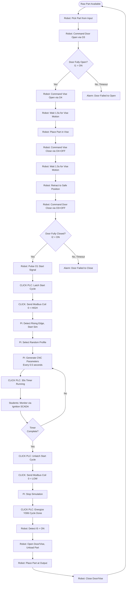
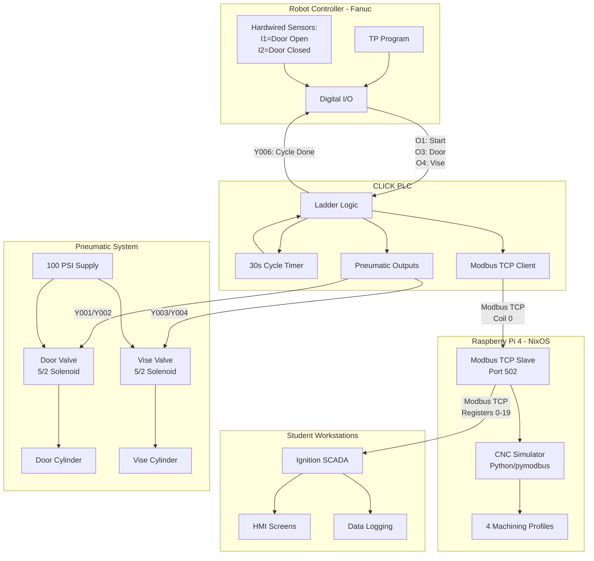
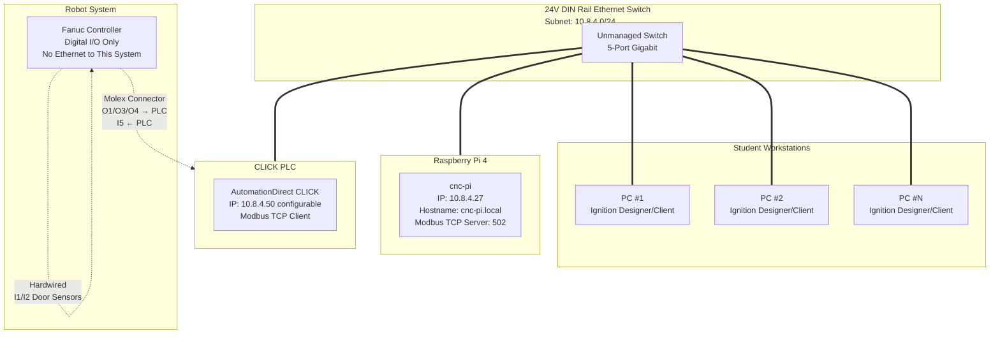
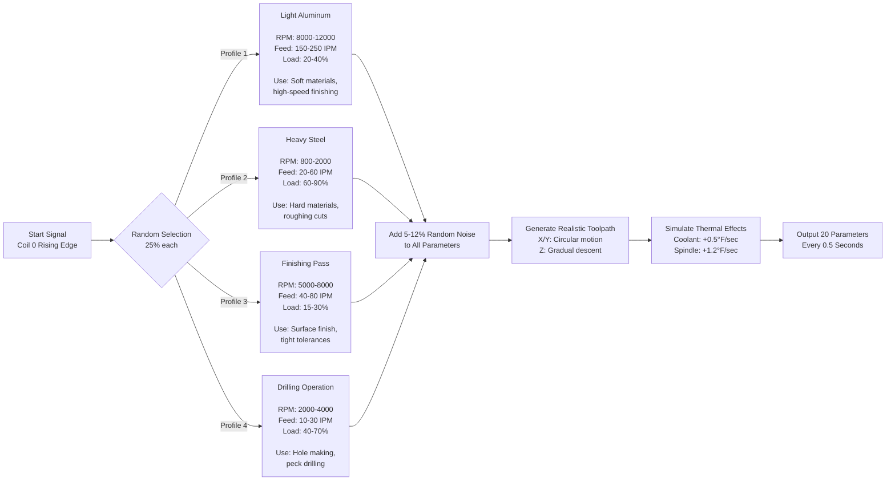
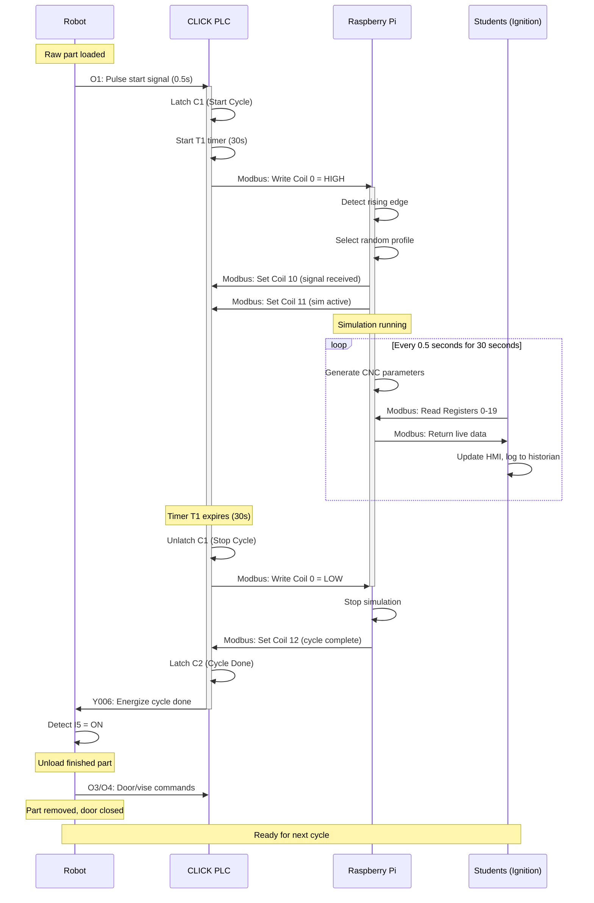
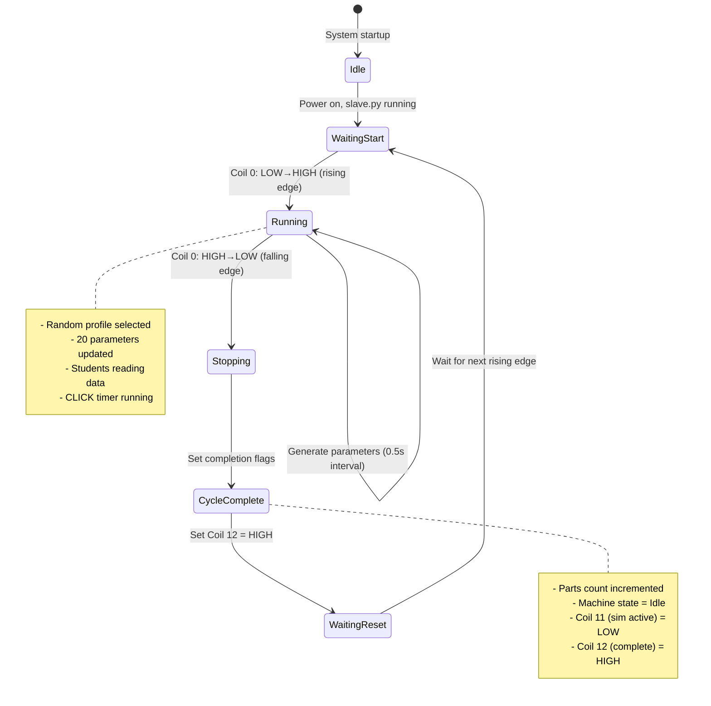

# CNC Simulator System Architecture

## Overview

**Course:** Robotics Systems Engineering 2 (RSE2)  
**Purpose:** Educational robot machine tending system simulating a Haas UMC-450 5-axis CNC mill  
**Duration:** 5-week module on robot tending operations

This system allows students to practice robot programming and SCADA monitoring without requiring actual CNC machining. The Raspberry Pi simulates realistic CNC parameters while the robot performs physical machine tending tasks (load/unload parts, door/vise control).

---

## ⚠️ System Safety Overview

### What the E-Stop Controls
- **STOPS:** CNC simulator (Pi), CLICK PLC outputs, pneumatics
- **DOES NOT STOP:** Robot controller (separate E-stop required)

### Major Hazards
- **100+ PSI pneumatics:** Door and vise actuators
- **Pinch points:** CNC door (2 locations), vise jaws
- **Electrical:** 200-480VAC in robot cabinet, 120VAC in PLC enclosure
- **Robot motion:** Moving manipulator during tending operations

---

## Machine Tending Workflow



---

## Communication Architecture



---

## Network Topology



**Key Points:**
- Robot I/O connected to CLICK PLC via **Molex quick-disconnect**
- Door sensors **hardwired directly to robot controller**
- Pi and PLC on same Ethernet switch for low-latency Modbus TCP
- Students can connect from any PC on the subnet

---

## I/O Signal Flow

### Robot → PLC Signals

| Robot Output | Wire | PLC Input | Purpose | Signal Timing |
|--------------|------|-----------|---------|---------------|
| O1 | Via Molex | X002 | Start cycle signal | 0.5s pulse |
| O3 | Via Molex | X003 | Door control (HIGH=open) | Level signal |
| O4 | Via Molex | X004 | Vise control (HIGH=open) | Level signal |

### PLC → Robot Signals

| PLC Output | Wire | Robot Input | Purpose | Signal Timing |
|------------|------|-------------|---------|---------------|
| Y006 | Via Molex | I5 | Cycle done | Latched until next cycle |

### Hardwired Robot Sensors

| Sensor | Wire | Robot Input | Purpose | Sensor Type |
|--------|------|-------------|---------|-------------|
| Door Open (Top) | Dedicated | I1 | Door fully open | NPN Inductive, NO |
| Door Closed (Bottom) | Dedicated | I2 | Door fully closed | NPN Inductive, NO |

---

## Machining Profile Selection



---

## Data Flow During Cycle



---

## State Machine (Pi Simulator)



---

## Key System Components

### Raspberry Pi 4 Model B
**Hardware:**
- 4GB RAM, quad-core ARM Cortex-A72
- Samsung 128GB SD card (2 available)
- Ethernet connection (10.8.4.27)

**Software:**
- NixOS 25.11 (declarative configuration)
- Python 3.13 with pymodbus 3.12.1
- devenv for development environment

**Role:**
- Modbus TCP slave server (port 502)
- CNC parameter generation and simulation
- Provides 20 registers of live machining data

### CLICK PLC (AutomationDirect)
**Model:** C0-02DD1-D (8 in, 8 out, 24VDC discrete)

**Role:**
- Robot I/O interface (start signal, cycle done)
- Pneumatic control (door/vise solenoids)
- Cycle timing (30-second timer)
- Modbus TCP master to Pi

**Ladder Logic Functions:**
- E-stop monitoring and safety interlocks
- Door/vise control based on robot commands
- 30s cycle timer
- Modbus communication with Pi
- Tower light indicators

### Robot Controller (Fanuc)
**I/O Configuration:**
- 3 outputs: O1 (start), O3 (door), O4 (vise)
- 3 inputs: I1 (door open), I2 (door closed), I5 (cycle done)

**Programming:**
- TP (Teach Pendant) language primary
- Python option available (advanced students)

**Role:**
- Execute machine tending sequence
- Control pneumatic door/vise via outputs
- Monitor door position sensors
- Signal PLC to start/stop cycles

### Student Workstations
**Software:** Ignition SCADA (Designer + Vision/Perspective)

**Activities:**
- Connect to Pi via Modbus TCP
- Create HMI screens for monitoring
- Log production data
- Calculate OEE and performance metrics
- Generate shift reports

---

## Pneumatic System Details

### Air Supply
- **Pressure:** 100+ PSI supply, regulated to 80 PSI
- **Filtration:** F/R/L unit (filter, regulator, lubricator)
- **Safety:** Manual shutoff valve for maintenance

### Solenoid Valves
- **Type:** 5/2 double-solenoid, spring-return
- **Voltage:** 24VDC
- **Safety:** De-energize = safe position (door closed, vise open)

### Actuators
- **Door Cylinder:** Double-acting, position sensors at each end
- **Vise Cylinder:** Double-acting, no position feedback (time-based)

### Safety Features
- Spring-return valves ensure safe state on power loss
- E-stop de-energizes all solenoid outputs
- Door must be closed before cycle can start (I2 interlock)

---

## Timing Diagram

```
Robot Start Signal (O1)     ___                        ___
                        ___|   |______________________|   |___

CLICK Start Cycle (C1)      ___________               ___________
                        ___|           |_____________|           |__

Pi Coil 0 (Modbus)          ___________               ___________
                        ___|           |_____________|           |__

CLICK 30s Timer (T1)        0--------30s              0--------30s

Pi Simulation Active        [=GENERATING DATA=]       [=GENERATING=]

CLICK Cycle Done (Y006)            ________                 ________
                        ___________|        |_______________|        |

Robot I5 Input                     ________                 ________
                        ___________|        |_______________|        |

Door Open (O3/Y001)     __________          ________  __________
                        |          |________|        ||          |__

Vise Open (O4/Y003)       ________          ________    ________
                        _|        |________|        |__|        |__
```

**Typical Cycle Duration:** 60-90 seconds total
- 10s: Door/vise open, load part
- 5s: Close door/vise, signal PLC
- 30s: Machining simulation
- 2s: Cycle complete signal
- 10s: Open door/vise, unload part
- 5s: Close door/vise, return to start

---

## System Specifications

| Parameter | Specification |
|-----------|---------------|
| **Cycle Time** | 30 seconds (configurable in PLC) |
| **Update Rate** | 0.5 seconds (2 Hz parameter generation) |
| **Network Latency** | < 10ms (Ethernet, same switch) |
| **Modbus Response** | < 50ms typical |
| **Door/Vise Motion** | 1.5-2.0 seconds (pneumatic) |
| **Simultaneous Students** | Unlimited (read-only Modbus access) |
| **Data Parameters** | 20 CNC registers, 3 status flags |
| **Profiles** | 4 machining profiles (random selection) |

---

## Safety Interlocks

### Hardware Interlocks
1. **E-stop:** De-energizes all PLC outputs immediately
2. **Spring-return valves:** Default to safe positions
3. **Separate robot E-stop:** Required to stop robot motion

### Software Interlocks (PLC Ladder Logic)
1. **Door closed check:** I2 must be ON before starting cycle
2. **E-stop check:** X001 must be closed for any output
3. **Timeout protection:** All waits have timeout limits
4. **Cycle interlock:** Cannot start new cycle while one is running

### Operational Procedures
1. **Low-speed testing:** Always test at 25-50% first
2. **Visual monitoring:** Never run unattended
3. **E-stop accessibility:** Operator within reach of E-stop
4. **Clearance verification:** Check area before starting

---

## Future Expansion Possibilities

### Hardware Enhancements
- Additional sensors (part present detection, pressure monitoring)
- Barcode scanner for part tracking
- Vision system for quality inspection
- Multiple Pi units for multi-machine simulation

### Software Enhancements
- More machining profiles (tapping, boring, contouring)
- Realistic alarm conditions (tool breakage, coolant low)
- Integration with MES (Manufacturing Execution System)
- Advanced SCADA analytics (predictive maintenance, SPC)

### Educational Additions
- ABB or UR robot integration (multi-vendor training)
- Advanced PLC programming (structured text, ladder)
- Industrial IoT/Industry 4.0 concepts
- OPC UA communication protocols

---

## Document Maintenance

**Last Updated:** March 3, 2026  
**Review Schedule:** Annually or when system is modified  
**Maintained By:** RSE2 Course Instructor  
**Revision History:**
- v1.0 (2026-03-03): Initial release with correct I/O and safety warnings
